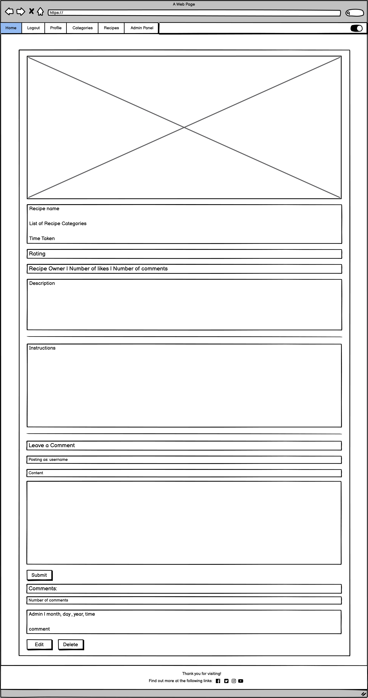
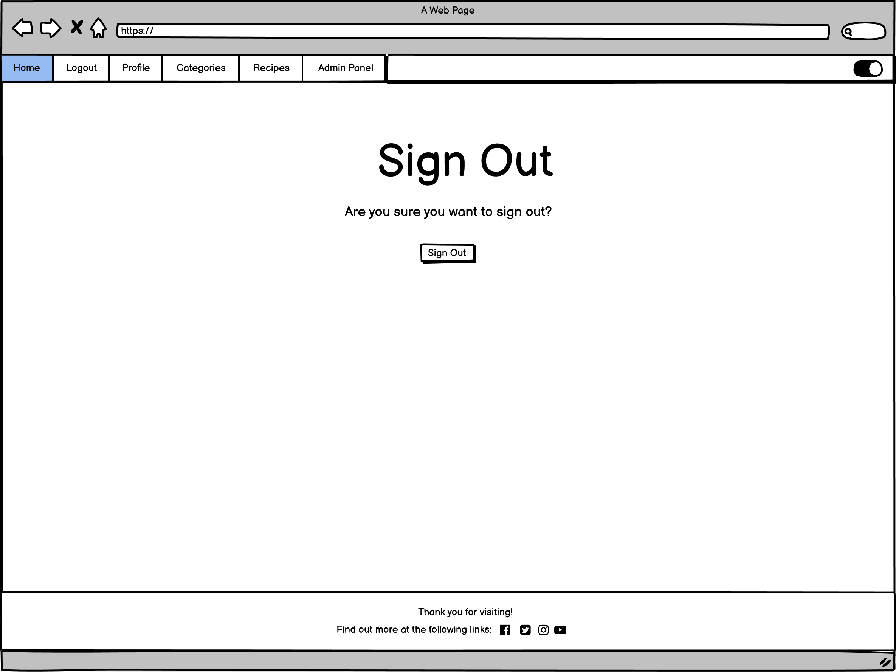
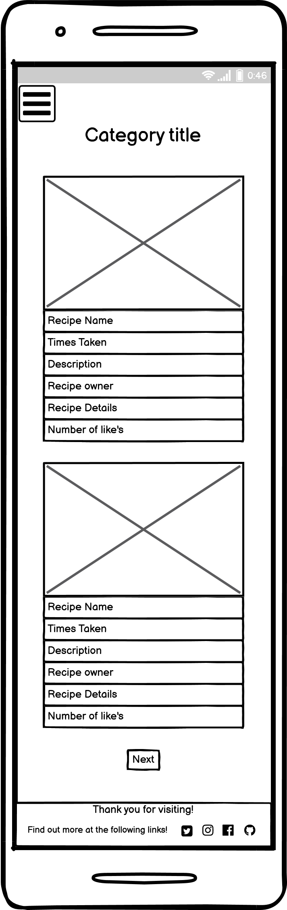
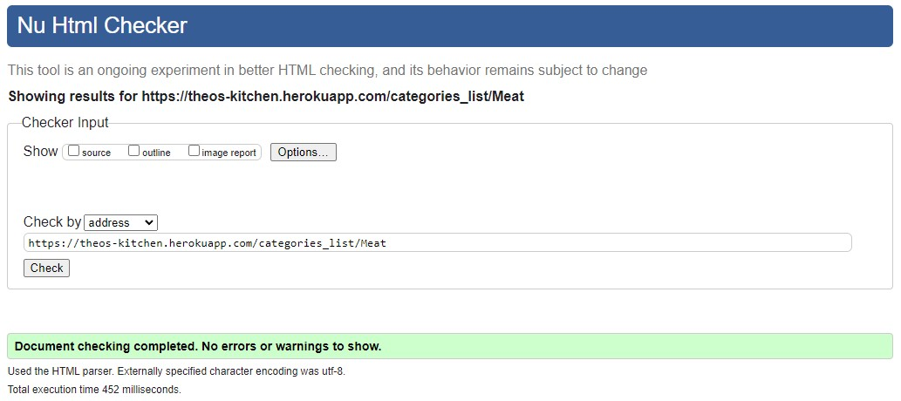
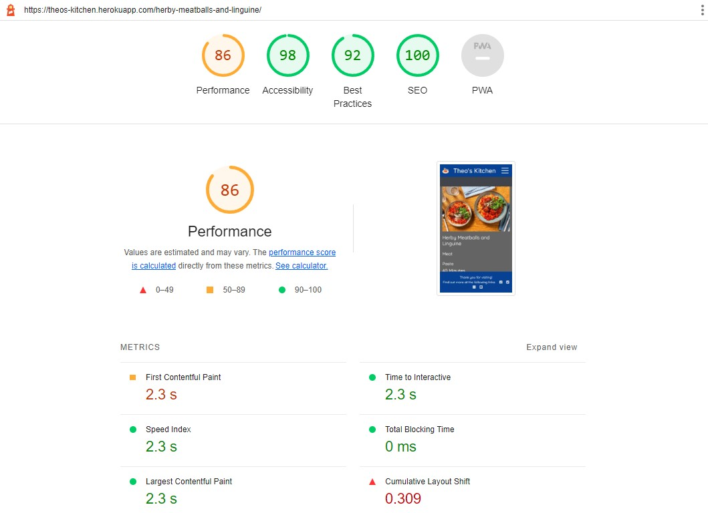
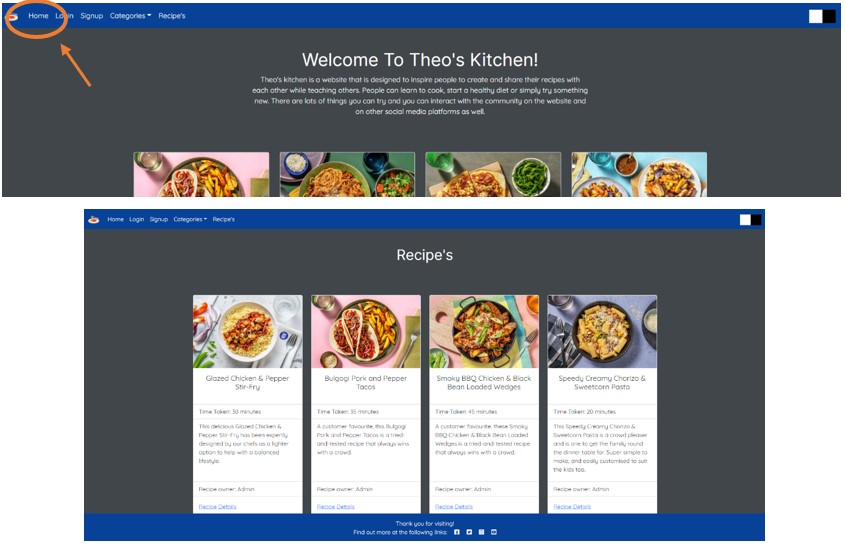

# Theo's Kitchen
(Developer: Benjamin Draper)

 [Live webpage](https://theos-kitchen.herokuapp.com/)

## About

Theo's kitchen is a website that inspire's people to create and share their recipes with each other while teaching others. People can learn to cook, start a healthy diet or simply try something new. With the account system you can favorite the recipes you like the most and add your own to share with the community as well.

## Table of Content
1. [Project Goals](#project-goals)
    1. [Website User Goals](#website-user-goals)
    2. [Website Owner Goals](#website-owner-goals)
2. [User Experience](#user-experience)
    1. [Target Audience](#target-audience)
    2. [User Requirements and Expectations](#user-requirements-and-expectations)
3. [User Stories](#user-stories)
4. [Design](#design)
    1. [Design Choices](#design-choices)
    2. [Colour](#colour)
    3. [Fonts](#fonts)
    4. [Structure](#structure)
    5. [Wireframes](#wireframes)
5. [Technologies Used](#technologies-used)
    1. [Languages](#languages)
    2. [Frameworks and Tools](#frameworks-and-tools)
    3. [Libraries](#libraries)
6. [Features](#features)
7. [Validation](#validation)
    1. [HTML Validation](#html-validation)
    2. [CSS Validation](#css-validation)
    3. [JavaScript Validation](#javascript-validation)
    4. [Python Validation](#python-validation)
    5. [Accessibility](#accessibility)
    6. [Performance](#performance)
    7. [Device Testing](#device-testing)
    8. [Browser Compatibility](#browser-compatibility)
8. [Testing user stories](#testing-user-stories)
9. [Bugs](#bugs)
10. [Deployment](#deployment)
11. [Credits](#credits)
12. [Acknowledgements](#acknowledgements)
 
## Project Goals
### Website User Goals
- As a website user, I want to be able to register for an account and log in and out when I wish.
- As a website user, I want to be able to view the recipe's stored on the website.
- As a website user, I want to be able to submit my own recipes to share with others.
- As a website user, I want to have easy options to navigate around the website.

### Website Owner Goals
- As the website owner, I want to promote the website to new and existing users.
- As the website owner, I want the users to be able to create an account and add their own recipes.
- As the website owner, I want users to be able to search for recipes and favorite the ones that they like.
- As the website owner, I want to a user friendly and easily navigable user interface.

[Back to Table Of Content](#table-of-content)

## User Experience
### Target Audience
- This website is targets people who want to learn more about how to cook healthy meals.
- This website targets people looking to loose weight by eating a healthy diet.
- This website targets people who want to learn how to cook simple but tasty meals.

### User Requirements and Expectations
- The user can expect an intuitive and accessible navigation system.
- The user can expect to easily find healthy and easy to cook recipes.
- The user can expect all links work as expected and functions perform their tasks correctly.
- The user can expect presentation is in line with the website guidelines and the website is visually appealing on all screen sizes.
- The user can expect easy to read headings to tell the users at a glance what they are looking at.
- The user can expect accessibility features to be clearly defined.

[Back to Table Of Content](#table-of-content)

## User Stories
1. As a first time user I would like to be able to navigate through the website easily so that it is easy to find the information I am looking for.
2. As a first time user would like to be able to sign up for an account so that I can interact with the community.
3. As a first time user I want to see the available recipes that are on the website so that I can learn to eat healthier.
4. As a first time user I want to know about the website and its ethos so that I know I am getting a good service and unbiased opinion.
5. As a first time user I want to know how to find social media links so that I can have in depth conversation with my peers. 
6. As a returning user I would like to be able to favourite the recipes I like the most so that I can easily find them again later.
7. As a returning user I would like to be able to upload my own recipes to share with the community so that I can get their thoughts and feedback on my recipes.
8. As the website owner I want there to be a section for featured recipes so that the admin approved 'best' recipes are shown first.
9. As the website owner I want the recipes divided into categories so that users looking for something specific can navigate easier.
10. As the website owner I want the website to act responsively to all device sizes so that the website can be viewed across all devices.
11. As the website owner I want users to get redirected to custom error pages so that they understand when when something has gone wrong and can be redirected back to the main website.
12. As the website owner I want users to create and manage their own accounts so that they can engage in conversation, favourite recipes and add their own.
13. As the website owner I want users to be able to comment on the recipe's on the website and share their opinions so that they can engage with the community more. 
14. As the website owner I want to be able to manually approve comments so that all comments meet the website's ethos.

### Agile Methodology

All functionality and development of this project were managed using GitHub which Projects can be found
[here](https://github.com/users/benjamindraper1996/projects/4)

[Back to Table Of Content](#table-of-content)

## Design
### Design Choices
The website was designed to be responsive and and easy to navigate with a attractive colour pallette that compliments the goals of the website.

### Colour
For the colour scheme I have opted to implement a dark and light theme while using colours that compliment the goals and ambitions of the website. To narrow down the choice of colours I used [coolors](https://coolors.co/) an example of both the dark and light theme are shown below.
 

#### Dark Mode

 

#### Light Mode

### Fonts
 I am using Inter font with a backup of sans-serif across the website for the title and headers. This is used to maintain a Consistent and professional look with an easily readable format. 
 
For the Secondary font for the body text the owners decided to use Quicksand with a backup of sans-serif, this will help to maintain the consistent theme across the website.

### Structure
The website has been built using a template engine so that all pages follow the same design to maintain the feel across the website.

The Pages are structured in a Regularly used, user friendly and well-known format. This makes each page easy to navigate, coupled with a responsive navbar and footer this gives the user many options for navigating around the website.

The website consists of 9 main pages, some views spread from these pages and an Error Page.
- Home page
- Login page
- Signup page
- Logout page
- Profile page
- Recipes page
    - Recipe details page to show a full description of the recipe.
- Catagories page
    - Recipe categories page for each category.
- Add Recipes page
- Edit Recipes page
- Error pages (to guide the user back to the main website)

#### Database
- The website was built using Python and the Django framework with a postgres database to store all of our information.

Database Diagram

The following models were created to represent the real database model structure within the website database.

Recipe Model
- The Recipe model contains all the information about the recipe in question, this is the main model that links to the comments, category and user models.

Category Model
- The Category model contains a list of categories that can be applied to the recipe as well as an image for the categories page so that we can have some visual clarity when on the website.

Comment Model
- The Comment model contains information about the comments people have places on which recipe, who made the comment and weather the comment is approved by the admin team.

User Model
- The User model contains all the information on each user, this comes from Django's All-Auth library.

### Wireframes

Mobile Design

Home Page

Recipe Page

Recipe Details Page

Profile Page

Add Recipes Page

Edit Recipes Page

Login Page

Logout Page

Signup Page

Categories Page

Category Page

Desktop Design

Home Page

Recipe Page

Recipe Details Page

Profile Page

Add Recipes Page

Edit Recipes Page

Login Page

Logout Page

Signup Page

Categories Page

Category Page

 

[Back to Table Of Content](#table-of-content)

## Technologies Used
### Languages
- [HTML](https://www.w3schools.com/html/default.asp)
- [CSS](https://www.w3schools.com/css/default.asp)
- [JavaScript](https://www.w3schools.com/js/default.asp)
- [Python](https://www.w3schools.com/python/default.asp)

### Frameworks and Tools
- [GitHub](https://github.com/) was used to maintain the version control and store the project remotely
- [Gitpod](https://gitpod.io/) was used to write all the code and to link up with Github to maintain the version control.
- [Balsamiq](https://balsamiq.com/) was use to create the wireframes for the website.
- [Google Fonts](https://fonts.google.com/) was used to pick out the fonts in use across the website.
- [Favicon](https://favicon.io/) was used to create the favicon.
- [coolors](https://coolors.co/) was used to generate a colour pallette.
- [Am I Responsive?](https://ui.dev/amiresponsive) was used to test the responsive nature of the website design.
- [Bootstrap](https://getbootstrap.com/) was used for the pre-defined components and responsive nature of the layout.
- [Heroku](https://dashboard.heroku.com/) was used to host the website for the additional back-end functionality.
- [Cloudinary](https://cloudinary.com/) was used for its free persistent file storage capability over heroku.
- [W3C HTML Validator](https://validator.w3.org/) was used to validate the HTML
- [W3C CSS Validator](https://jigsaw.w3.org/css-validator/) was used to validate the CSS.
- [WAVE](https://wave.webaim.org/) was used to validate the accessibility of the website.
- [JShint](https://jshint.com/) was used to validate the Javascript.
- [PEP8 Online](http://pep8online.com/) was used to validate the Python.
- [Google Lighthouse](https://developer.chrome.com/docs/lighthouse/overview/) was used to validate the website performance, best practice and SEO.
- [SendinBlue](https://www.sendinblue.com/) was used as our email service to receive our password reset emails.

### Libraries
- [Django](https://www.djangoproject.com/) – JUSTIFICATION: Django is used as both a framework and templating engine to speed up the development of the project.
- [Gunicorn](https://gunicorn.org/) – JUSTIFICATION: Gunicorn is used as the WSGI HTTP Server.
- [PostgreSQL](https://www.postgresql.org/) – JUSTIFICATION: PostgresSQL is used as the database to make sure we have persistent storage for the recipes.
- [Psycopg2](https://pypi.org/project/psycopg2/) – JUSTIFICATION: Psycopg2 is a database adapter helping me to access the data and is required for Postgres.
- [Dj-database-url](https://pypi.org/project/dj-database-url/) – JUSTIFICATION: is used to link the database to our deployed version using a URL environment variable.
- [Dj3-cloudinary-storage](https://pypi.org/project/dj3-cloudinary-storage/) – JUSTIFICATION: is used to link cloudinary to our deployed version using a URL environment variable for persistent image storage.
- [Summernote](https://summernote.org/) – JUSTIFICATION: Summernote is used to allow users to type their own recipes into the website using a simple text editor.
- [Django-Allauth](https://pypi.org/project/django-allauth/0.13.0/) – JUSTIFICATION: Django-Allauth is being used to provide email authentication and password management.
- [Anymail](https://pypi.org/project/django-anymail/0.1.dev2/) – JUSTIFICATION: Anymail is being used to allow us to send our emails through the SendinBlue email service.

[Back to Table Of Content](#table-of-content)

## Features
### Navbar / Dropdown Menu
- Featured on all pages across the website.
- The Navbar / Dropdown menu is fully responsive and changes to a hamburger style button for smaller screen sizes.
- The Navbar / Dropdown menu has a link to login or sign up for an account.
- The Navbar / Dropdown menu includes links to allow users to navigate around the website easily.
- The Navbar / Dropdown menu includes the dark theme switch toggler option for users that prefer to use a lighter of darker theme.
- user stories covered: 1,2,10,12,13

Navbar / Dropdown Menu

Navbar / Dropdown Menu Light

Navbar / Dropdown Menu Dark

 

### Footer
- Featured across the whole website.
- The Footer contains links to the various social media handles.
- The Footer contains Information on how to get in touch with support when needed.
- The footer is fully responsive down to mobile size devices.
- User stories covered: 1,5,10

Footer

 

### User Sign Up
- The User sign up form allows users to create an account to interact with the community.
- When a user signs up for an account they are able to favorite and share their own recipes with the community.
- The User sign up form is fully responsive down to mobile size devices.
- User stories covered: 2,6,7,10,12,13

User Sign Up

 

### User Login
- The User login form allows users to login to an existing account to interact with the community.
- When a user logs in to their account they are able to favorite and share their own recipes with the community.
- The User login form is fully responsive down to mobile size devices.
- User stories covered: 6,7,10,12,13

User Login

 

### Favorites
- The favorites are a feature of the user model, it acts as a list of ID's for the recipes the users likes the most and would like to come back to.
- The favorites feature also allows users make a list of items that they can find through their account page.
- The favorites feature also shows you the number of likes a recipe has received.
- User stories covered: 6,12

Favorites

 

### Add and Edit Recipes
- The Add and Edit Recipe pages allows the user to add their own recipe to the website.
- The Add and Edit Recipe pages allows a users to edit their own recipes but should not allow them to edit others.
- The Add and Edit Recipe pages are fully responsive down to mobile size devices.
- User stories covered: 7,10,12

Add and Edit Recipes

 

### Recipe List
- The recipes list is shown on the recipes page and displays a list of all the recipes.
- The recipes list is ordered by rating, this can be set by the admin.
- The recipes list is also paginated so that the user can only see 6 recipes at a time with navigation underneath.
- User stories covered: 1,3,4

Recipe List

 

### Welcome Message/ Ethos
- The welcome message/ ethos is located on the home page and easily found as soon as you navigate to the site.
- The welcome message/ ethos lets users know they are getting a good service and unbiased opinion.
- User stories covered: 4

Welcome Message/ Ethos

 

### Categories
- The categories page allows users to filter the recipes by what type of meal they are looking for.
- The categories page displays a list of only the current categories, if any are added or removed the list will update.
- The categories page is fully responsive down to mobile size devices.
- User stories covered: 1,3,9,10

Categories

 

### Featured Recipes
- The featured recipes are shown on the home page.
- The featured recipes are a list of recipes selected by the admin to be the best recipes.
- Only the featured recipes will show in this list, ordered by rating.
- The featured recipes list is fully responsive down to mobile size devices.
- User stories covered: 1,3,8,10

Featured Recipes

 

### Recipe Comments
- The Recipe  comments are shown on the Recipe details page.
- The Recipe comments are unique per Recipe.
- The Recipe comments are set to be manually approved by an admin for this project, in a real world deployment this can be changed to allow for different settings. 
- User stories covered: 7,12,14

Recipe Comments

 

### Error Pages
- The custom Error pages are used to replace the standard error pages from django.
- The custom Error pages cover 400, 404, 403, 500 errors.
- The featured recipes list is fully responsive down to mobile size devices.
- User stories covered: 1,10,11

Error Pages

 

### Social Media Links
- The social media links can be found in the footer.
- The social media links link to various social media handles, opening in a new tab.
- User stories covered: 5

Social Media Links

 

[Back to Table Of Content](#table-of-content)

## Validation
### HTML Validation
I used the W3C Validation Service to validate the HTML of the website.
All pages passed with no errors, these were run as web pages to combines the parts of the template into completed versions for the browser, with the exception of the error pages which would not be recognised by W3C.

Home Page

Login Page

Logout Page

Signup Page

Categories Page

Category Page

Recipes Page 

Recipe Details Page 

Add Recipes Page 

Edit Recipes Page 

Profile Page 

Error Page 

 

### CSS Validation
I used the W3C Jigsaw CSS Validation Service to validate the CSS of the website.
My CSS passed with no errors and warnings to show.

CSS Validation

 

### JavaScript Validation
JSHint Static Code Analysis Tool for JavaScript was used to validate the Javascript file.
The file for the theme switch passed with no errors.

Theme Switch

 

### Python Validation
I used the PEP8 Validation Service to validate the python code for the website.
My code passed with no errors and warnings to show.

Recipe App

admin.py

context_processor.py

forms.py

models.py

urls.py

views.py

tests.py

 

### Accessibility
I used WAVE WebAIM web accessibility evaluation tool to ensure the website met high accessibility standards. All pages passed with no errors, the profile page had to be run through the web extension as it would normally require a user to be logged in to an account and the standard API was not able to work around this.

Home Page

Login Page

Logout Page

Signup Page

Categories Page

Category Page

Recipes Page 

Recipe Details Page 

Add Recipes Page 

Edit Recipes Page 

Profile Page 

Error Page 

 

### Performance
Google Lighthouse in Google Chrome Developer Tools was used to test the performance of the website. 

Home Page

Login Page

Logout Page

Signup Page

Categories Page

Category Page

Recipes Page 

Recipe Details Page 

Add Recipes Page 

Edit Recipes Page 

Profile Page 

Error Page 

 

### Device Testing
The website was tested on the following devices:
- Huawei Matebook D15
- MacBook Pro 13” 2019
- Samsung Galaxy S21 FE 5G
- Samsung Galaxy S20 FE 5G
In addition, the website was tested using Google Chrome Developer Tools Device Toggling option for all available device options.

### Browser Compatibility
The website was tested on the following browsers in both regular and incognito modes:
- Google Chrome
- Mozilla Firefox
- Microsoft Edge

## Testing user stories
 

1. As a first time user I would like to be able to navigate through the website easily so that it is easy to find the information I am looking for.

| **Feature** | **Action** | **Expected Result** | **Actual Result** |
|-------------|------------|---------------------|-------------------|
| Navbar / Dropdown Menu | On any page of the website, at the top of the page, find the Navbar and use it to navigate to a new page | Navbar link takes you to the selected page | Works as expected |
| Footer | On any page of the website, at the bottom of the page, locate the footer containing contact and social media information | Footer is located at the bottom of every page. | Works as expected |
| Error Pages | From any page on the website, go to the URL bar and add onto the end of the url a random string on characters to be redirected to an error page | The error page loads as expected. | Works as expected |

Screenshots

 

2. As a first time user I would like to be able to sign up for an account so that I can interact with the community.

| **Feature** | **Action** | **Expected Result** | **Actual Result** |
|-------------|------------|---------------------|-------------------|
| User Sign Up | From any page on the website, when not logged in, locate the Sign Up button on the Navbar to take you to the Sign Up form. | Fill out and submit the form to be signed into your profile. | Works as expected |

Screenshots

 

3. As a first time user I want to see the available recipes that are on the website so that I can learn eat healthier.

| **Feature** | **Action** | **Expected Result** | **Actual Result** |
|-------------|------------|---------------------|-------------------|
| Recipe List | From any page on the website use the Navbar to navigate to the Recipes page. | See a list of all the recipes orders by their ratings | Works as expected |
| Categories | From any page on the website use the Navbar to navigate to the Categories page. | See a list of all the Categories on the website. | Works as expected |
| Featured Recipes | From any page on the website use the Navbar to navigate to the Home page. | See a list of all the Featured Recipes orders by their ratings | Works as expected |

Screenshots

 

4. As a first time user I want to know about the website and its ethos so that I know I am getting a good service and unbiased opinion.

| **Feature** | **Action** | **Expected Result** | **Actual Result** |
|-------------|------------|---------------------|-------------------|
| Welcome Message/ Ethos | From any page on the website, use the Navbar to navigate to the home page and view the Welcome message. | Read about the company, what we do and its ethos. | Works as expected |

Screenshots

 

5. As a first time user I want to know how to find social media links so that I can have in depth conversation with my peers.

| **Feature** | **Action** | **Expected Result** | **Actual Result** |
|-------------|------------|---------------------|-------------------|
| Footer | On any page of the website scroll all the way down to the bottom of the page and locate the Footer with social media links. | Footer is located at the bottom of every page. | Works as expected |

Screenshots

 

6. As a returning user I would like to be able to favorite the recipes I like the most so that I can easily find them again later.

| **Feature** | **Action** | **Expected Result** | **Actual Result** |
|-------------|------------|---------------------|-------------------|
| Favorites | From any page of the website and once logged into an account, using the Navbar navigate to the Recipes page, find a recipe you like and locate the heart icon at teh bottom of the card and click it mark it as a Favorite recipe, using the Navbar, navigate to the account page and view the users favorite recipes. | The user can see their favorite recipes. | Works as expected |

Screenshots

 

7. As a returning user I would like to be able to upload my own recipes to share with the community so that I can get their thoughts and feedback on my recipes.

| **Feature** | **Action** | **Expected Result** | **Actual Result** |
|-------------|------------|---------------------|-------------------|
| Add and Edit Recipes | From any page and when signed into an account, using the Navbar, navigate to the 'Profile' page where you can find a list of the current recipes you have added or add a new one. | The user can add a new recipe to the website or edit an existing one that they have input using the form. | Works as expected |
| Recipe Comments | From the recipe page select a recipe to view the Recipe details, where you can locate the recipe comments.  | The user is able to read the comments and share their own thoughts with the community. | Works as expected |

Screenshots

 

8. As the website owner I want there to be a section for featured recipes so that the admin approved 'best' recipes are shown first.

| **Feature** | **Action** | **Expected Result** | **Actual Result** |
|-------------|------------|---------------------|-------------------|
| Featured Recipes | From any page on the website use the Navbar to navigate to the Home page. | See a list of all the Featured Recipes orders by their ratings | Works as expected |

Screenshots

 

9. As the website owner I want the recipes divided into categories so that users looking for something specific can navigate easier.

| **Feature** | **Action** | **Expected Result** | **Actual Result** |
|-------------|------------|---------------------|-------------------|
| Categories | From any page of the website, use the Navbar to navigate to the categories page and select a category from the list shown. | The user is taken to a Category page with only recipes specific to this category type. | Works as expected |

Screenshots

 

10. As the website owner I want the website to act responsively to all device sizes so that the website can be viewed across all devices.

| **Feature** | **Action** | **Expected Result** | **Actual Result** |
|-------------|------------|---------------------|-------------------|
| Responsive Design | Using Google Chrome Browser and on any page of the website, open chrome developer tools and resize the webpage. | The webpage reacts responsively and any elements that require resizing are downsized for smaller screens. | Works as expected |

Screenshots

 

11. As the website owner I want users to get redirected to custom error pages so that they understand when when something has gone wrong and can be redirected back to the main website.

| **Feature** | **Action** | **Expected Result** | **Actual Result** |
|-------------|------------|---------------------|-------------------|
| Error Pages | From any page of the website, go to the url bar and add on to the end of the url with a random string of characters. | The user is redirected to a custom Error page to match the theme and design of the website. | Works as expected |

Screenshots

 

12. As the website owner I want users to create and manage their own accounts so that they can engage in conversation, favorite recipes and add their own.

| **Feature** | **Action** | **Expected Result** | **Actual Result** |
|-------------|------------|---------------------|-------------------|
| User Sign Up | From any page of the website, using the Navbar, navigate to the 'User Sign up' page and fill out the form. | The user is able to create and account and will be redirected to the profile page after completion. | Works as expected |

Screenshots

 

13. As the website owner I want users to be able to comment on the recipe's on the website and share their opinions so that they can engage with the community more.

| **Feature** | **Action** | **Expected Result** | **Actual Result** |
|-------------|------------|---------------------|-------------------|
| Recipe Comments | From the recipe page select a recipe to view the Recipe details, where you can locate the recipe comments.  | The user is able to read the comments and share their own thoughts with the community. | Works as expected |

Screenshots

 

14. As the website owner I want to be able to manually approve comments so that all comments meet the website's ethos.

| **Feature** | **Action** | **Expected Result** | **Actual Result** |
|-------------|------------|---------------------|-------------------|
| Recipe Comments | As the website admin from any page use the Navbar to access the admin panel, locate the comments option and filter by not approved, read and make sure the comments meet the websites, guidelines before approving the comment. | The comment gets approved and becomes visible on the normal website for everyone to see. | Works as expected |

Screenshots

 

[Back to Table Of Content](#table-of-content)

## Bugs
| **Bug** | **Fix** |
| ------- | ------- |
| Heroku First Build failed | Incorrect config var set as 'DISABLE_COLLECT_STATIC' instead of 'DISABLE_COLLECTSTATIC', changed to fix during development. |
| Error when loading the '/admin/recipe/add' page. | Forgetting to run the migrations first, run migrations to fix. |
| Category pages not displayed in list within the NavBar | Add helper return reverse 'category' slug to Category model |
| Recipe_details page no loading when called getting no reverse url error. | Used 'post' model call instead of 'recipe' |
| Posting a recipe comment causes a no reverse match for edit comment. | Edit comment function had not been written yet, URL was commented out ahead of time. |
| Navbar not showing Categories, listing invisible Recipe names instead in dropdown. | Under recipe.views.py the categories_view method incorrectly pulled from the wrong variable. |
|  |  |

[Back to Table Of Content](#table-of-content)

## Deployment

### Heroku
This application has been deployed from GitHub to Heroku by following the steps:

1. Create or log in to your account at heroku.com
2. Create a new app, add a unique app name and choose your region
3. Click on create app
4. Go to "Settings"
5. Under Config Vars store any sensitive data you saved in .json file. Name 'Key' field, copy the .json file and paste it to 'Value' field. Also add a key 'PORT' and value '8000'.
6. Add required buildpacks (further dependencies). For this project, I set up 'Python' and 'node.js' in that order.
7. Go to "Deploy" and select "GitHub" in "Deployment method"
8. To link up our Heroku app to our Github repository code enter your repository name, click 'Search' and then 'Connect' when it shows below
9.  Choose the branch you want to build your app from
10. If preferred, click on "Enable Automatic Deploys", which keeps the app up to date with your GitHub repository
11. Wait for the app to build. Once ready you will see the “App was successfully deployed” message and a 'View' button to take you to your deployed link.

### Forking the GitHub Repository
1. Go to the GitHub repository
2. Click on Fork button in top right corner
3. You will then have a copy of the repository in your own GitHub account.
   
### Making a Local Clone
1. Go to the GitHub repository 
2. Locate the Code button above the list of files and click it
3. Highlight the "HTTPS" button to clone with HTTPS and copy the link
4. Open Git Bash
5. Change the current working directory to the one where you want the cloned directory
6. Type git clone and paste the URL from the clipboard ($ git clone https://github.com/YOUR-USERNAME/YOUR-REPOSITORY)
7. Press Enter to create your local clone

[Back to Table Of Content](#table-of-content)

## Credits
Images and Logos not referenced below are owned by the developer.

### Media
All of the media featured on the website is not owned by the developer. The images and recipes added by the Admin have all been sourced from [Hello Fresh](https://www.hellofresh.co.uk/). 

Any further recipes and images added by third parties and individuals have been obtained by the third party.

| **Link to Asset** | **Created By** | **Web Source** |
| ------------------- | ---------------- | ---------------- |
| [Favicon Spaghetti](https://favicon.io/emoji-favicons/spaghetti) | [Favicon Team](https://favicon.io/emoji-favicons/spaghetti) | [Favicon](https://favicon.io/emoji-favicons/spaghetti) |
| [Meat](https://res.cloudinary.com/ludicrouswolf/image/upload/v1662850401/kvlx8qxtaxehfi0h4hia.jpg) | [Mali Maeder](https://www.pexels.com/@mali/) | [Pexels](https://www.pexels.com/photo/red-meat-with-chili-pepper-and-green-spies-65175/) |
| [Pasta](https://res.cloudinary.com/ludicrouswolf/image/upload/v1662851686/nmholsozceciht0oxxe5.jpg) | [Pixabay](https://www.pexels.com/@pixabay/) | [Pexels](https://www.pexels.com/photo/yellow-pasta-spaghetti-eat-42326/) |
| [Rapid](https://res.cloudinary.com/ludicrouswolf/image/upload/v1662850378/cjiwo5amwqxmamxgbxyb.jpg) | [Tara Winstead](https://www.pexels.com/@tara-winstead/) | [Pexels](https://www.pexels.com/photo/dried-leaves-on-the-table-7111168/) |
| [Vegetarian](https://res.cloudinary.com/ludicrouswolf/image/upload/v1662851626/phzfriq5etvrmp1mebca.jpg) | [Engin Akyurt](https://www.pexels.com/@enginakyurt/) | [Pexels](https://www.pexels.com/photo/flat-lay-photography-of-variety-of-vegetables-1435904/) |
| [Under 650 Calories](https://res.cloudinary.com/ludicrouswolf/image/upload/v1662851794/ycthi1qesivvgdui4ecq.jpg) | [Ella Olsson](https://www.pexels.com/@ella-olsson-572949/) | [Pexels](https://www.pexels.com/photo/flat-lay-photography-of-vegetable-salad-on-plate-1640777/) |
| [female crushing banana](https://www.pexels.com/photo/female-crushing-banana-in-hand-against-orange-background-6156962/) | [Laker](https://www.pexels.com/@laker/) | [female crushing banana](https://www.pexels.com/photo/female-crushing-banana-in-hand-against-orange-background-6156962/) |

### Code
- The Django All-Auth code and webpages were used from the Django blog project and then customized for this project.
- A thankyou to 'toolman23' from Stackoverflow, on this [post](https://stackoverflow.com/questions/55314246/pre-populate-slug-field-into-a-form-field-of-a-django-site) his comment on a post where someone had a very similar issue to mine setting default values for user form including the slug for my recipes and getting the username for the author. Another thankyou to 'thepylot' who suggested using slugify to turn my recipe titles into the slug with ease.
- The Cloudinary file upload and image transformations was found in the [Cloudinary doc's](https://cloudinary.com/documentation/django_image_and_video_upload), which gave a thorough description of how to handle file uploads and pull requests in various formats.
- Pagination used in multiple pages explained in the course materials from Code Institute

[Back to Table Of Content](#table-of-content)

## Acknowledgements

I would like to take the opportunity to thank:
- My mentor Mo Shami, for his professional feedback, advice, guidance, and support.
- My partner Megan Fox, for her support advice, help testing, inspiration for the project and allowing me the time to work on my project.
- To the Code Institute Slack community for providing help and support.

[Back to Table Of Content](#table-of-content)
